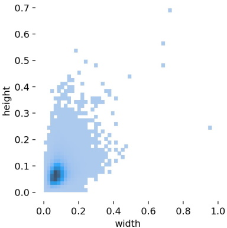
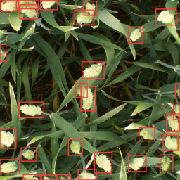
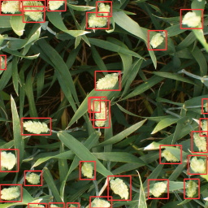
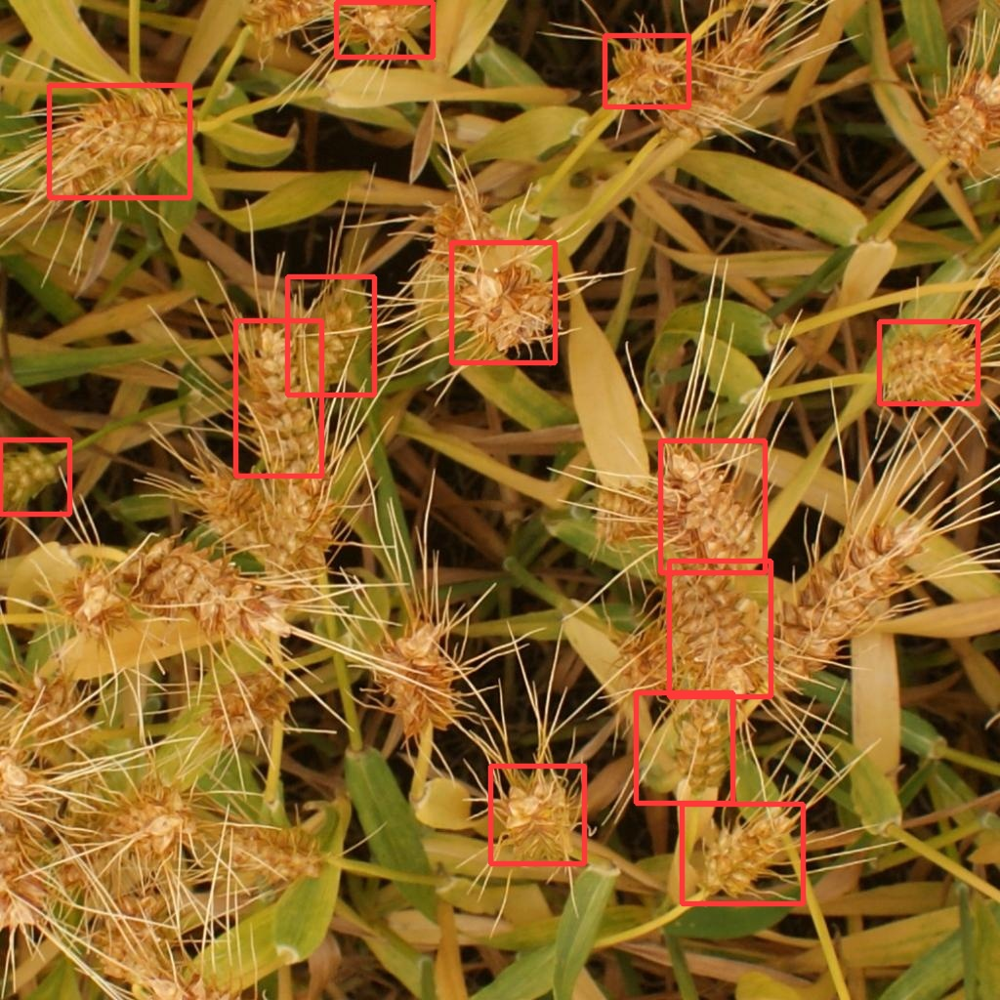
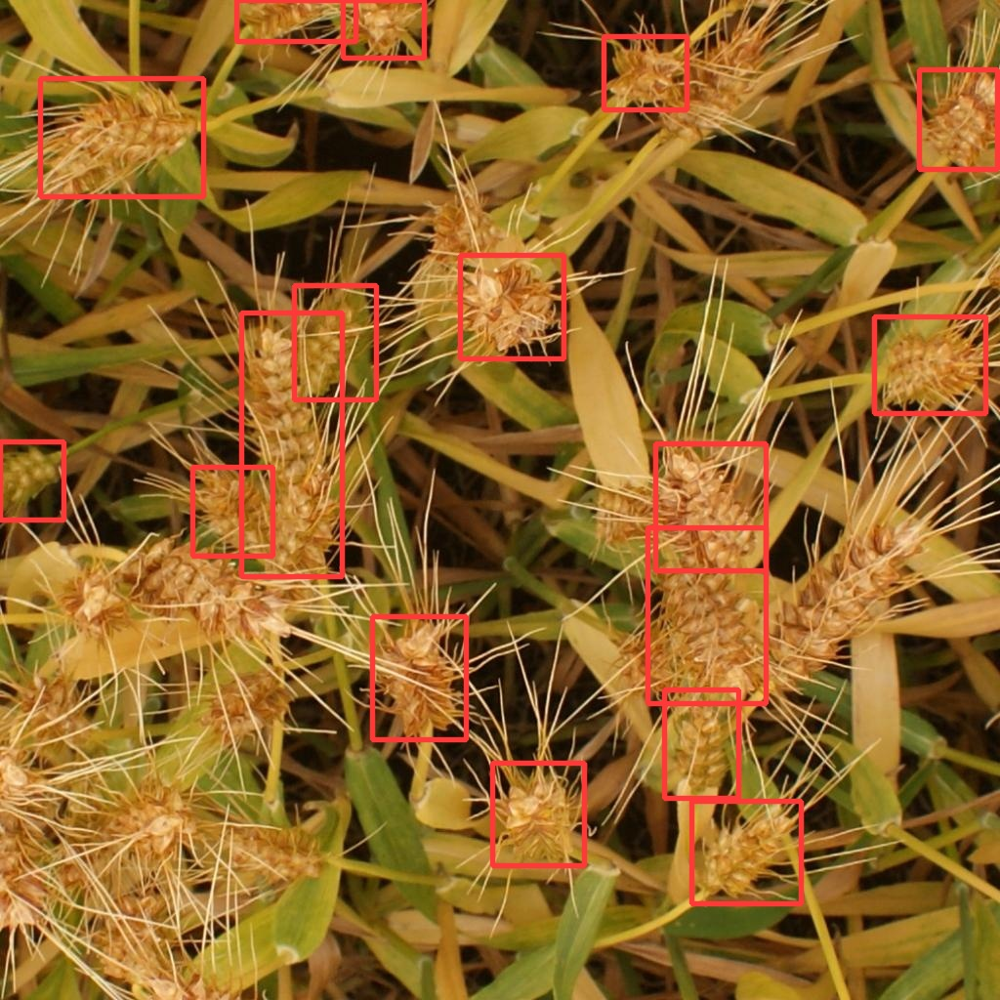

# Global Wheat Detection
The implementation of deep learning approach for wheat detection.


The full problem was presented here:
https://www.kaggle.com/c/global-wheat-detection

## Approach
### Goal
The competition is already over, so the goal of this pet project is to 
get a relatively fast solution which can be actually applied in the real
software products.

### Detector choice
#### Architecture
R-CNN models won't be considered due to their 
2-step nature leading to higher processing times.

There are advanced architectures like DE⫶TR that may produce high quality
results, but there is a problem with them:
> A single epoch takes 28 minutes, so 300 epoch training takes around 6 days on a single machine with 8 V100 cards
> ([link](https://github.com/facebookresearch/detr))

I don't have 8 V100 cards to experiment with :-( The true SOTA on COCO
dataset is [SWIN](https://github.com/microsoft/Swin-Transformer). The smallest
version of this architecture requires 267 GFLOPs while YOLOv5s requires 17 GFLOPs.

Among single shot detection architectures the relatively fast ones are
YOLO and EfficientDet families. SqueezeDet is not considered due to its low 
accuracy comparing to other detectors.
I've decided to utilize YOLOv5 since is may fit the task in terms of
training and inference time. YOLOv5 became a source of controversy and turned out to be
worse than YOLOv4 in some tasks. I wanted to check how it performs at this
specific task.

#### Dataset size
Another reason of choosing smaller detector is the amount of available data. Unlike COCO with its 200K+
labeled images, current dataset contains ~3.5K images. Complex models
benefit from large datasets, but they struggle in generalizing on fewer samples.


## Dataset
Wheat Detection Dataset consists of photos of wheat of different types
and colors on complex backgrounds.
- train set: 3422 images
- test set: 10 images
Images size: 1024⨯1024
  
Objects are quite small on images. In the most cases, width and height
of wheat are smaller than 10% of the image side size. The distribution
of object sizes is shown below:



## Training
Before you can run the training, you should clone the YOLOv5 repository

```git clone https://github.com/ultralytics/yolov5```

and then provide the path to **train.py** via ```--yolo_dir``` argument.

Unpack the wheat dataset and provide its directory via ```--dataset```.
The dataset will be automatically converted into YOLOv5 format.

The converted dataset is stored into ```--log_dir```.

If you re-run the training, and the dataset is already converted, you can
provide the ```--preprocessed``` argument and set the folder of the
preprocessed dataset by ```--dataset```.


## Experiments
Train data were divided into train and validation sets at 4/1 ratio.
- Train set = 2699 images
- Validation set = 674 images


### YOLOv5s, 256 px image size
In the first experiment, the image side size was set to 256 px to check
if the network can detect wheat when it is very small
(20-30 px side size on average).
The training is performed with the ```--evolve``` key that varies
training and augmentation hyperparameters.
Batch size = 96. Epochs = 200.

#### Processing time
On RTX 2080 Super training of a single epoch took ~10 seconds.
Evaluation took ~15 seconds.

#### Result
I trained the network for 200 epochs. mAP increased at very slow rate by that time;
however, there is still room for improvement, but it will take much more time.

###### Validation set

- mAP_0.5:0.95: 0.4721
- mAP_0.5: 0.9058

###### Test set
> Model Summary: 224 layers, 7053910 parameters, 0 gradients

>image 1/10 ...\2fd875eaa.jpg: 256x256 29 wheats, Done. (0.019s)

>image 2/10 ...\348a992bb.jpg: 256x256 36 wheats, Done. (0.017s)

>image 3/10 ...\51b3e36ab.jpg: 256x256 27 wheats, Done. (0.016s)

>image 4/10 ...\51f1be19e.jpg: 256x256 24 wheats, Done. (0.016s)

>image 5/10 ...\53f253011.jpg: 256x256 30 wheats, Done. (0.016s)

>image 6/10 ...\796707dd7.jpg: 256x256 13 wheats, Done. (0.016s)

>image 7/10 ...\aac893a91.jpg: 256x256 26 wheats, Done. (0.017s)

>image 8/10 ...\cb8d261a3.jpg: 256x256 26 wheats, Done. (0.016s)

>image 9/10 ...\cc3532ff6.jpg: 256x256 26 wheats, Done. (0.017s)

>image 10/10 ...\f5a1f0358.jpg: 256x256 27 wheats, Done. (0.016s)

Average inference + NMS time = 16 ms.

Visually, detections are not bad at all.



All detection visualizations on the test set can be found at ```images\YOLOv5s_256px``` directory.

### YOLOv5s, 1024 px image size
In the second experiment, the image side size was set to the original 
1024 px to check if I there is an advantage of making the network
see the wheat heads at high resolution.
The training is performed with the ```--evolve``` key that varies
training and augmentation hyperparameters.
Batch size = 8. Epochs = 100.

#### Processing time
On RTX 2080 Super training of a single epoch took ~60 seconds.
Evaluation took ~21 seconds.

#### Result
I trained the network for 100 epochs. mAP increased at very slow rate by that time;
however, there is still room for improvement, but it will take much more time.

###### Validation set

- mAP_0.5:0.95: 0.5370
- mAP_0.5: 0.925

###### Test set
> image 1/10 ...\2fd875eaa.jpg: 1024x1024 30 wheats, Done. (0.022s)

> image 2/10 ...\348a992bb.jpg: 1024x1024 37 wheats, Done. (0.020s)

> image 3/10 ...\51b3e36ab.jpg: 1024x1024 26 wheats, Done. (0.020s)

> image 4/10 ...\51f1be19e.jpg: 1024x1024 18 wheats, Done. (0.020s)

> image 5/10 ...\53f253011.jpg: 1024x1024 29 wheats, Done. (0.020s)

> image 6/10 ...\796707dd7.jpg: 1024x1024 17 wheats, Done. (0.020s)

> image 7/10 ...\aac893a91.jpg: 1024x1024 21 wheats, Done. (0.020s)

> image 8/10 ...\cb8d261a3.jpg: 1024x1024 25 wheats, Done. (0.020s)

> image 9/10 ...\cc3532ff6.jpg: 1024x1024 27 wheats, Done. (0.020s)

> image 10/10 ...\f5a1f0358.jpg: 1024x1024 27 wheats, Done. (0.019s)

Average inference + NMS time = **20 ms**.

Visually, detections are not bad at all.



All detection visualizations on the test set can be found at ```images\YOLOv5s_1024px``` directory.


#### Data

[Training log at Weights and Biases](https://wandb.ai/filonenkoa/yolov5s_wheat/reports/Global-Wheat-Detection-with-YOLOv5s--Vmlldzo3NjM0NzM?accessToken=g5t5f8t9s6taq8dqw9xvwtvhy8kdrje1pg8z0n60r8vs5ezv1rlcgwyovkvm782v)

Checkpoints are at the ```checkpoints``` directory.


## Conclusion
### Processing time
There is 25% difference in inference + NMS time between 256⨯256 and 1024⨯1024 image sizes (16 vs 20 ms 
respectively) on RTX 2080 Super meaning that most os operations are parallelized well.

### Detection performance
While there is a noticeable difference in mAP on validation set 256⨯256 and 1024⨯1024 (0.4721 vs 0.5370),
visually the network have similar performance. They both could not detect wheat in the bottom-left corner 
of ```796707dd7.jpg``` image in the test set. The 1024 px version detects better on image borders.


256 px |  1024 px 
:---:|:---:
      |  